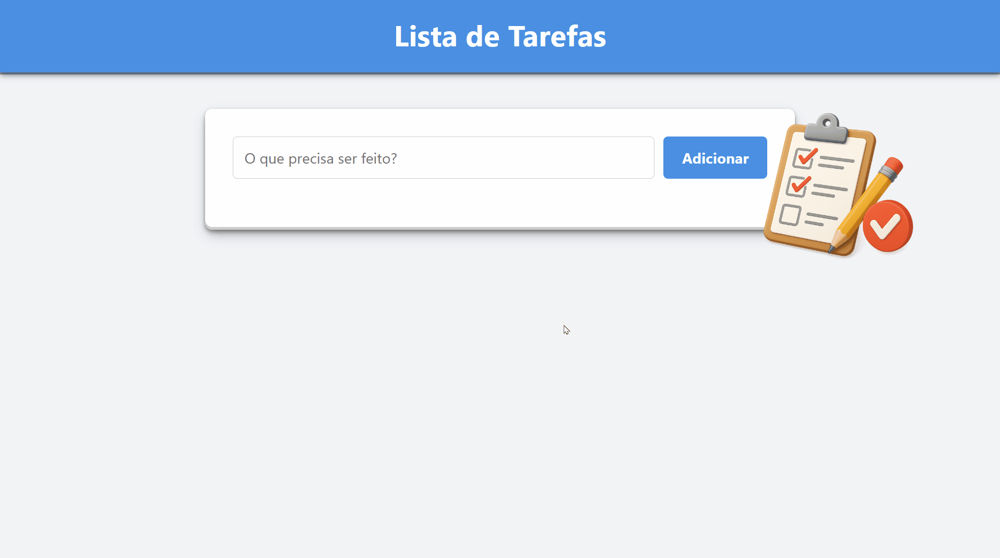

# To-Do List

[🇺🇸 English](./README.md) | [🇧🇷 Português](./README.pt.md)


This is a simple To-Do List project designed to help you organize your daily activities. The main feature of this project is **data persistence**: your tasks are saved locally in your browser, ensuring that you don't lose your notes when you close or reload the page.

---
### 📋 Index

- [Project Overview](#-project-overview)
- [Highlights & Features](#-highlights--features)
- [Technologies Used](#-technologies-used)
- [Prerequisites](#-prerequisites)
- [Installation](#-installation)
- [How to Use](#-how-to-use)
- [Contribution](#-contribution)
- [License](#-license)
- [Author](#-author)
---


## 🚀 Project Overview

A simple and intuitive web application to manage your daily tasks. Easily add or remove tasks, and most importantly: your data remains saved in the browser for the next time you log in!

[](https://github.com/emellybmuniz/to-do-list)

## ✨ Highlights & Features

- **Quick Task Addition:** Clean interface for quickly adding new tasks.
- **Data Persistence:** Tasks are saved in the browser's localStorage, so they are not lost when reloading the page.
- **Task Management:** Add tasks or remove them from the list.
- **Responsive Design:** Works well on mobile devices and desktops.

## 🛠️ Technologies Used

This project was built using the following technologies:


## ⚙️ Prerequisites

To run this project, all you need is your favorite web browser! 😉


## 📦 Installation

```bash
# 1. Clone this repository
$ git clone https://github.com/emellybmuniz/to-do-list.git
# 2. Navigate to the project directory
$ cd to-do-list
# 3. Open in your browser

# Linux
$ xdg-open index.html

# macOS
$ open index.html

# Windows
$ start index.html
```


## 💡 How to Use

1. Open the `index.html` file in your browser.
2. Type a new task in the “What needs to be done?” input field.
3. Click the “Add” button to add the task to your list.
4. Done! The tasks will be saved for the next time you open the site.
5. Click on the trash can icon to permanently delete it.


## 🤝 Contribution

Contributions are always welcome and **greatly appreciated!** Feel free to open an issue or submit a pull request.

1. Fork the repository.
2. Clone your fork to your machine: (`git clone https://github.com/your-username/to-do-list.git`)
3. Configure the original repository as upstream *(optional):*
    ```bash
    git remote add upstream https://github.com/emellybmuniz/to-do-list.git
    git fetch upstream
    git checkout main
    git merge upstream/main`
    ```
4. Create a new *branch* (`git checkout -b feature/amazing-feature`).
5. Commit your changes (`git commit -m 'Add amazing feature'`).
6. Push to the branch (`git push origin feature/amazing-feature`).
7. Open a Pull Request.   


## 🔑 License

This project does not have a specified license. Feel free to view the code for educational purposes, but please give credit if you reuse any part of it.


## ✍️ Author

Crafted with ❤️ by **Emelly Beatriz**

📬 Get in touch:
📧 emellybmuniz@gmail.com |
💼 [Linkedin](https://www.linkedin.com/in/emellybmuniz) |
🐙 [Github](https://github.com/emellybmuniz)

